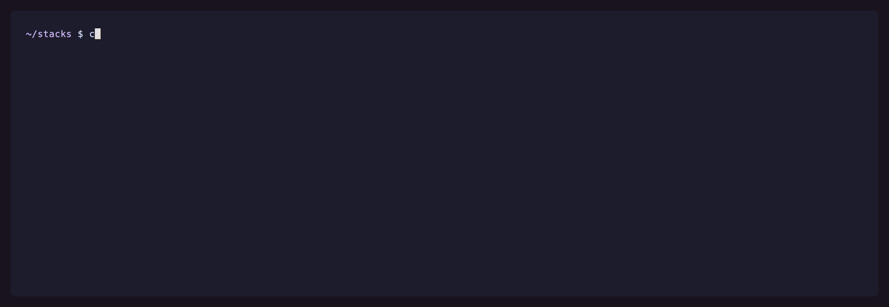

<p align="center">
  
</p>

<h1 align="center">Compose-Check-Updates</h1>

<p align="center">
  <strong>Keep your Docker Compose image tags up to date — like <code>npm-check-updates</code>, but for <code>compose.yaml</code>.</strong>
</p>

<p align="center">
  <a href="https://github.com/p-arndt/compose-check-updates/actions/workflows/ci.yml"></a>
  <a href="https://github.com/p-arndt/compose-check-updates/releases/latest"></a>
  <a href="LICENSE"></a>
  
</p>

```bash
ccu              # open the TUI and pick what to update
ccu check        # just print what's outdated
ccu check -u     # print and write the new tags
```

Point it at a directory, it scans every Compose file below it, asks each registry
what's newer, and — if you want — rewrites the tags for you. One static binary,
no daemon, no runtime.

<p align="center">
  
</p>

**[Install](#install) · [Commands](#commands) · [`ccu check` flags](#ccu-check-flags) · [Config reference](#config-reference) · [Recipes](#recipes) · [TUI keys](#tui-keys) · [JSON output](#json-output) · [Troubleshooting](#troubleshooting)**

## Install

```bash
curl -fsSLO https://github.com/p-arndt/compose-check-updates/releases/latest/download/ccu-linux-amd64
mv ccu-linux-amd64 ccu && chmod +x ccu && sudo mv ccu /usr/local/bin/
ccu version
```

linux/macOS/windows on `amd64`, `arm64`, `arm`, `386` — see
[Releases](https://github.com/p-arndt/compose-check-updates/releases), every one
ships a `checksums.txt`. On Windows just put the `.exe` on your `PATH`.
Afterwards `ccu self-update` replaces the binary in place.

## Commands

`cd` into the directory holding your stacks and run `ccu`. Everything below it is
scanned recursively. Nothing is written unless you ask — `A` in the TUI, `-u` for
`check` — and every modified file gets a `.ccu` backup beside it.

| Command | What it does |
| ------- | ------------ |
| `ccu` | The TUI: browse what's outdated, pick rows, apply. Default. |
| `ccu check` | One-shot report for scripts, cron and CI. No UI. |
| `ccu config` | Show the resolved configuration and where it came from |
| `ccu config -image <name>` | Explain how one image's settings were resolved |
| `ccu self-update` | Download, verify and replace the running binary |
| `ccu check-update` | Only report whether a newer ccu exists |
| `ccu help` / `ccu version` | — |

> [!TIP]
> Piped or redirected, `ccu` runs the `check` report (as JSON) instead of the
> TUI and says so on stderr — old cron and CI entries keep working.

## `ccu check` flags

```bash
ccu check              # report only (patch updates by default)
ccu check -f           # consider every newer version, not just patches
ccu check -u -r        # write the new tags, then restart the services
ccu check -d ./stacks  # scan a different directory
ccu check -image traefik  # check one image and nothing else
```

| Flag | Description | Default |
| ---- | ----------- | ------- |
| `-d` | Directory to scan | `.` |
| `-exclude` | Directories to exclude, comma-separated | none |
| `-image` | Only check images matching this name or pattern, repeatable and comma-separated | all |
| `-config` | Read this config file instead of searching for one | none |
| `-u` | Update the Compose files with the new image tags | `false` |
| `-r` | Restart the services after updating | `false` |
| `-f` | Full mode — consider every newer version, not just patches | `false` |
| `-major` / `-minor` / `-patch` | Only suggest that level | `-patch` |
| `-versioning` | Default tag-reading scheme: `semver` or `loose` | `semver` |
| `-min-age` | Only offer tags published at least this long ago, e.g. `7d` or `36h` | none |
| `-format` | Output format: `auto`, `pretty` or `json` | `auto` |
| `-pin-floating` | Pin floating tags (`latest`, `main`, …) to the digest they resolve to | `false` |
| `-dockerfiles` | Also check the base images of Dockerfiles built by a compose service | `true` |

Only `-d`, `-exclude`, `-image`, `-config`, `-pin-floating`, `-dockerfiles`,
`-versioning` and `-min-age` also apply to the TUI — it picks levels in the UI instead and always resolves
every level.

**Exit codes:** `0` nothing to do · `1` updates available, not applied ·
`2` something failed. So a CI gate needs no parsing:

```bash
ccu check -f || echo "images are behind"
```

## Config reference

Two files, neither required — `~/.config/ccu/config.yaml` for preferences across
every project, `.ccu.yaml` in the scan root or any parent for settings that
travel with the stacks. Project layers over global, flags over both.
`ccu config` prints what was read.

```yaml
# .ccu.yaml — every key is optional
exclude: [node_modules, services/legacy]
pin_floating: true
dockerfiles: false
versioning: semver
min_age: 7d
floating_tags: [release, canary]

images:
  library/traefik:
    max: minor
    min_age: 3d
  nousresearch/hermes-agent:
    versioning: loose
  acme/dated:
    versioning: regex
    versioning_pattern: '^(?P<major>\d{4})-(?P<minor>\d{2})-(?P<patch>\d{2})$'
  internal/thing:
    reference_tag: stable
    floating_tags: [release]
```

### Top-level keys

| Key | Values | Default | Meaning |
| --- | ------ | ------- | ------- |
| `exclude` | list of paths | none | Directories never scanned. Unioned with `-exclude`, not replaced. |
| `pin_floating` | bool | `false` | Offer floating tags the digest they resolve to |
| `dockerfiles` | bool | `true` | Also check `FROM` lines of Dockerfiles built by a service |
| `versioning` | `semver`, `loose` | `semver` | How tags are read as versions, run-wide |
| `min_age` | duration (`7d`, `36h`) | none | Only offer tags published at least this long ago |
| `floating_tags` | list of tags | see below | Extra tags treated as moving. **Added** to the built-in set. |
| `images` | map | — | Per-image settings, keyed by image name **without tag or digest** |

`exclude` matches `backup` at any depth, `services/legacy` only that path,
`/mnt/backups` that absolute location — all three with `*` wildcards.

### Per-image keys (under `images:`)

| Key | Values | Meaning |
| --- | ------ | ------- |
| `max` | `major`, `minor`, `patch` | Cap: never offer a bump above this level |
| `versioning` | `semver`, `loose`, `regex` | Tag-reading scheme for this image. Outranks the flag. |
| `versioning_pattern` | Go regex | Required by, and only valid with, `versioning: regex` |
| `reference_tag` | tag name | The moving tag digest mode compares against, instead of `latest` |
| `floating_tags` | list of tags | Extra moving tags for this repository only |
| `min_age` | duration (`7d`, `36h`) | Settling time for this image. Outranks the run-wide key and the flag. |

### Why `min_age`

A tag that went out an hour ago is the one most likely to be pulled, rebuilt or
followed by a `.1` before the day is out. `min_age` says how long a release has
to have been on the registry before ccu offers it: with `min_age: 7d`, a `1.4.2`
published yesterday is skipped and you are offered `1.4.1` instead — the newest
tag *at that level* that is old enough. Nothing is hidden permanently; the same
tag is offered as soon as it has settled.

The age comes from the `created` field of the image's config blob (falling back
to the `org.opencontainers.image.created` annotation). Registries that record
neither leave ccu with no age, and a tag whose age is unknown is offered as
usual — `min_age` skips tags known to be young, not ones it cannot date.

> [!TIP]
> A setting not arriving is almost always the key: lookup is **exact**, on the
> name as ccu reports it — `library/traefik`, never `traefik`. Ask about the one
> image with `ccu config -image library/traefik`; it names the layer and the file
> that decided each value, and offers a near-miss as a hint.

## Recipes

<details>
<summary><strong>Check a single image</strong></summary>

`-image` narrows a run to the images it names, and nothing else is looked up —
no registry sees a request for the rest:

```bash
ccu check -f -image traefik              # one image, every level
ccu check -u -image 'ghcr.io/immich-app/*'   # a whole namespace, applied
```

A pattern **without** a `/` is matched against the last part of the name, so
`traefik` finds `library/traefik` and `immich-server` finds
`ghcr.io/immich-app/immich-server`. One **with** a `/` is matched against the
full name as ccu reports it. Both take `*`, and unlike a shell glob it spans
`/`: `ghcr.io/*` reaches every repository under that host. Matching is
case-sensitive.

Repeat the flag or separate the patterns with commas — `-image traefik,nginx`
is `-image traefik -image nginx`. If nothing matches, ccu says so on stderr and
exits `0`. The flag applies to the TUI as well (`ccu -image traefik`), and there
is no config key for it: it selects what *this* run looks at.

</details>

<details>
<summary><strong>Private registries and rate limits</strong></summary>

Any OCI registry works — Docker Hub, GHCR, Quay, Harbor, ECR, a self-hosted
`registry:2`. Private repos need no setup: `ccu` reads the credentials
`docker login` already stored. Logging in also lifts Docker Hub's anonymous rate
limit, which starts to matter past a few dozen images.

</details>

<details>
<summary><strong>Tags kept in a variable (<code>${IMMICH_VERSION}</code>)</strong></summary>

Plenty of stacks keep the release in the `.env` next to the Compose file rather
than in the file itself:

```yaml
# docker-compose.yml
services:
  server:
    image: ghcr.io/immich-app/immich-server:${IMMICH_VERSION}
```

```bash
# .env
IMMICH_VERSION=v1.119.0
```

`ccu` interpolates the reference the way `docker compose` does — your shell
environment first, then the `.env`, then a default written into the reference
itself (`${IMMICH_VERSION:-release}`) — so it checks the tag your stack actually
runs on. `${VAR}`, `$VAR`, `${VAR:-default}`, `${VAR-default}` and the `$$`
escape are all understood.

Updates are written back **where the version lives**. For the stack above that
is the `.env` line, with the Compose file left untouched:

```diff
-IMMICH_VERSION=v1.119.0
+IMMICH_VERSION=v1.120.1
```

Quoting, spacing and trailing comments on that line survive, and the `.env` gets
its own `.ccu` backup. Only the variable's share of the tag moves: on
`postgres:${PG_VERSION}-alpine` the `-alpine` stays in the Compose file and just
`PG_VERSION` is raised.

Two cases are reported but not written, because there is no file to write them
to: a variable set in the environment `ccu` itself runs with, and a tag assembled
from more than one variable. A variable nothing defines is reported as
`unresolved-variable`, naming the variable and the `.env` it belongs in.

</details>

<details>
<summary><strong>"no tag matches the newest digest" — tags that aren't semver</strong></summary>

Plenty of images publish something that is a version but not a *semantic* one:
`nousresearch/hermes-agent` tags by date and sometimes rebuilds the same day —
`v2026.7.7` and `v2026.7.7.2` side by side. A fourth segment is not semver, so by
default those tags are not read as versions at all. Loosen the rule for that
image:

```yaml
images:
  nousresearch/hermes-agent:
    versioning: loose
```

| Scheme | Reads |
| ------ | ----- |
| `semver` | up to three segments, no leading zeros — the default |
| `loose` | up to six numeric segments, leading zeros, any suffix |
| `regex` | whatever your pattern names — per image only |

The first three segments stay major, minor and patch; anything past the third
orders the version but is reported as a **patch**. The suffix rule holds either
way: `3.19-alpine` only ever moves to another `-alpine` tag.

Three places can set the scheme, most specific first: a per-image entry, then
`--versioning=loose` for one run, then a run-wide `versioning:` in either config
file. A per-image entry outranks both defaults **including the flag** — a flag
meant as a quick try should not silently undo a preference written down on
purpose.

</details>

<details>
<summary><strong>Tags no fixed rule can read — <code>versioning: regex</code></strong></summary>

A dashed date — `2024-01-01` — reads under both schemes above as release `2024`
with `-01-01` mistaken for a prerelease, which orders `2024-12-31` before
`2024-02-01`: the alphabet, not the calendar. For those, say what a tag looks
like:

```yaml
images:
  acme/dated:
    versioning: regex
    versioning_pattern: '^(?P<major>\d{4})-(?P<minor>\d{2})-(?P<patch>\d{2})$'
```

A Go regular expression with **named groups**. Four carry numbers — `major`,
`minor`, `patch`, `build` — plus `suffix` for whatever trails them, separator
included. A group you leave out is `0`, so naming only `major` is enough; a group
named anything else is ignored, which lets you match parts you don't need. The
four order exactly as under `loose`.

The pattern must describe the **whole** tag — it is anchored, so a date buried in
`build-2024-01-01-x` is not one — and a tag it does not match is simply not a
version. There is no run-wide `versioning: regex` and no `--versioning=regex`: a
pattern fitting one repository's tags is meaningless for the next one's.

Patterns are checked when the config is read, so a typo fails the run and names
the image rather than quietly reading no tags:

```console
$ ccu config
ERROR  Error reading config  error=/repo/.ccu.yaml: image "acme/dated": versioning_pattern: "^(?P<major>\\d+$" is not a valid regular expression
```

</details>

<details>
<summary><strong>Digest-pinned and commit-tagged images</strong></summary>

Some images are pinned by digest, others tag every build with its commit
(`sha-e1c83ba`). For those `ccu` compares the manifest digest instead of the
version number and reports level `digest`:

| In your Compose file | What `ccu` does |
| -------------------- | --------------- |
| `image: vert:sha-438f91a` | Moves the tag to the one currently matching `latest`, e.g. `sha-e1c83ba` |
| `image: vert@sha256:abc…` | Rewrites the digest to the one `latest` now resolves to |
| `image: vert:1.2.3@sha256:abc…` | Bumps tag **and** digest together, so they stay consistent |
| `image: vert:latest` | Pinned to today's digest, with `-pin-floating` |

All of it hangs on one tag: `latest`, whose digest is what "newest" means for an
image with no readable version. A repository publishing no `latest` is skipped
with `no latest tag to compare against`. Name the moving tag it *does* publish
and it is back in the game:

```yaml
images:
  internal/thing:
    reference_tag: stable
```

The reference tag itself is never offered as the new tag — trading a fixed
reference for a moving one is not an update.

> [!NOTE]
> This queries tags individually, so the first check of such an image is
> noticeably slower. At most 250 tags of the same naming scheme are inspected.

</details>

<details>
<summary><strong>Pinning floating tags (<code>latest</code>, <code>main</code>, …)</strong></summary>

Floating tags always resolve to whatever is newest, so there is never a newer tag
to offer — and nothing in the Compose file to tell you the image behind the tag
changed. `-pin-floating` writes that down:

```yaml
-  image: nginx:latest
+  image: nginx:latest@sha256:b34848eff6db…
```

The tag still reads `latest`, but the digest now decides: `docker compose pull`
gets **that exact build** and stops following the tag. In exchange `ccu` can
*see* the drift — every later run compares the pinned digest against what
`latest` resolves to and reports a `digest` update. You trade automatic pulls for
a reviewable bump.

```bash
ccu check -pin-floating        # report them (level: pin)
ccu check -pin-floating -u     # and write them
```

```yaml
pin_floating: true
```

Built-in floating tags: `latest`, `main`, `master`, `edge`, `stable`, `nightly`,
`dev`, `develop`. If your registry moves a differently spelled one, add it —
globally is usually right, since a registry spells its moving tag the same way
across repositories:

```yaml
floating_tags: [release, canary]      # every image
images:
  internal/thing:
    floating_tags: [release, canary]  # this one only
```

Everything **adds up** rather than replacing, and nothing ever takes a name away:
the built-in names are a fact about how registries work, not a preference. A repo
publishing `release` almost certainly publishes `latest` beside it, and if naming
one made `ccu` forget the others, that `latest` would turn back into an ordinary,
pinnable tag.

In the TUI they sit behind the bar's `floating` stop (`p`); `pin_floating`
decides which way it starts. If the run wasn't asked to pin, the first press
fetches the digests then and there. Caps do not apply — pinning moves no version.

> [!NOTE]
> Once a digest is in the file, the image is that exact build until `ccu` moves
> it — this suits stacks you update deliberately, not ones relying on a nightly
> `pull`. It also costs one registry request per floating image, the other reason
> it's off by default. `-pin-floating=false` overrides `pin_floating: true` for a
> single run.

</details>

<details>
<summary><strong>Images you build yourself (<code>build:</code> + Dockerfile)</strong></summary>

A service with a `build:` has no image tag to check — the tag deciding what it
runs sits on the `FROM` line of its Dockerfile. Those are scanned too:

```dockerfile
-FROM quay.io/keycloak/keycloak:26.0.7 AS builder
+FROM quay.io/keycloak/keycloak:26.7.2 AS builder
```

The Dockerfile appears in the list under its own path, next to the compose file
that builds it, and behaves like any other row: levels, caps, targets, a `.ccu`
backup. Two specifics:

- **Every stage moves together.** A multi-stage build names its base as builder
  and as runtime; both are rewritten as one update — a runtime left a release
  behind its builder is a broken image, not a partial one.
- **A restart rebuilds.** `docker compose up -d --build`, since a new base image
  reaches the container only through a build.

Skipped, because no registry can answer for them: `FROM scratch`, a stage
referring to an earlier one (`FROM builder`), a reference assembled from build
args (`FROM ${BASE}`), `dockerfile_inline:`, and non-local contexts.
`-dockerfiles=false` or `dockerfiles: false` turns it off.

</details>

<details>
<summary><strong>The update notice</strong></summary>

A `ccu check` run also checks **at most once every 24 hours** whether a newer
release exists and prints one line to stderr. It never installs anything by
itself; `CCU_NO_UPDATE_CHECK=1` turns the check off.

</details>

## TUI keys

Updates grouped per Compose file, streaming in as registries answer.
**Arrows move; `space`/`enter` act on whatever has the focus.** `tab` reaches the
detail column on an image and the settings bar anywhere else. The detail column
also shows how long the target release has been out (`3d ago`). `A` applies, `?`
shows every key.

```
 show ‹ all ›   target ‹ major ›   [ issues 1 ]   [ apply 2 ]
```

You decide per row which version gets written, so a major bump never sneaks in.
Afterwards `ccu` offers to `docker compose up -d` the affected files.

<details>
<summary><strong>All keys</strong></summary>

| Key | Action |
| --- | ------ |
| `↑`/`↓` or `k`/`j` | Move the cursor. At the top of the list, `↑` carries on into the bar; on the bar, `↓` comes back |
| `pgup`/`pgdn` | Page up / down (`home`/`end` for first / last) |
| `←`/`h`, `→`/`l` | On a header: collapse / expand. On an image: open the details. In the details column: previous / next option. On the bar: previous / next stop |
| `space` / `enter` | Act on what has the focus: select the row, step a setting, press a button |
| `-` | Step the focused setting backwards |
| `z` | Fold/unfold the node under the cursor |
| `C` / `E` | Collapse all / expand all |
| `a` / `n` | Select / deselect everything under the cursor |
| `ctrl+a` / `ctrl+n` | Select / deselect the whole list |
| `f` | Cycle the display filter (which rows are shown) |
| `t` | Cycle the target level for **all** rows |
| `p` | List or hide the floating tags |
| `tab` | On an image: the details column (`tab` or `esc` returns). Otherwise: the top bar |
| `shift+tab` | Step back along the bar |
| `m` | The top bar, from anywhere; again for the next stop |
| `i` | Show the issues logged during the scan |
| `A` | Apply the **selected** updates |
| `u` | Apply **only the highlighted row** |
| `y` / `n` | Answer the restart prompt |
| `esc` | Back out of whatever has the keyboard (never quits) |
| `?` / `q` | Help / quit |

On a terminal too narrow for two columns the detail column moves *below* the
list rather than disappearing — the per-image target and cap have no keys of
their own.

Where the image says where it is built from, the detail column also names where
to read what changed: the release page of the tag you are about to write, cut
back to the repository when the column is too narrow for the whole link. Nothing
is opened for you — the link is there to be read or copied.

</details>

<details>
<summary><strong>Filter vs. target</strong> — which version actually gets written</summary>

`show` decides which rows are _visible_; `target` decides which version gets
_written_. Both sit on the top bar, both have a key (`f` and `t`); the row's own
target lives in the detail column. The target defaults to `major`, so out of the
box you are offered the highest available version. At `minor`, an image on
`traefik:v2.9.3` with `3.7.8` available re-points to the latest `2.11.x`; at
`patch`, to `2.9.4`.

The sidebar only offers levels an image actually has — `(+2)` after a version
means two other levels exist. A row with nothing at the current target shows as
`[-] … no patch update` and cannot be applied.

An image whose tags ccu could read nothing from shows as `[!] … unreadable · …`
and is never applied. On that row the sidebar grows a **versioning** field:
stepping it to `loose` saves the scheme to your config and re-checks that image
straight away — a repository ccu could not read is fixed where the problem is
shown.

The TUI always resolves **all** levels, regardless of `-patch`, `-minor`,
`-major` or `-f`. Those flags govern `ccu check` only.

</details>

## JSON output

On a terminal the report is the aligned, colour-coded listing; in a pipe it is
**JSON Lines** — one object per line, written as the scan resolves, so `jq` reads
it streaming. `--format=pretty` / `--format=json` force either one. Only the
report goes to stdout; warnings and notices go to **stderr**, so a pipe stays
parseable.

```json
{"kind":"update","image":"library/traefik","reference":"traefik:v2.9.3","services":["proxy"],"file":"proxy/compose.yaml","current":"v2.9.3","latest":"v3.2.0","level":"major","published":"2024-11-12T14:03:27Z","targets":{"minor":"v2.11.4","major":"v3.2.0"},"release_url":"https://github.com/traefik/traefik/releases/tag/v3.2.0","source_url":"https://github.com/traefik/traefik"}
{"kind":"unreadable","image":"ghcr.io/vert-sh/vert","reference":"ghcr.io/vert-sh/vert:sha-e1c83ba","file":"vert/compose.yaml","current":"sha-e1c83ba","level":"unreadable","reason":"no-tag-for-digest","message":"none of this image's tags matches its newest digest…"}
{"kind":"error","file":"data/docker-compose.yml","error":"fetching tags: 429"}
```

<details>
<summary><strong>Every key</strong></summary>

| Key | On | Meaning |
| --- | -- | ------- |
| `kind` | every line | `update`, `unreadable` or `error` — dispatch on this |
| `image` / `reference` | update | the image name, and the reference as the Compose file writes it |
| `services` | update | the Compose services that declare it; a list, because identical references are reported once |
| `file` | both | the Compose file, or the Dockerfile when the update sits on a `FROM` line |
| `compose_file` | Dockerfile updates | the Compose file that builds it, i.e. the one to hand `docker compose -f` |
| `current` / `latest` | update | the tag now, and the one this run picked |
| `published` | update | when the image behind `latest` was built, RFC 3339 — absent when the registry does not say |
| `level` | update | `major`, `minor`, `patch`, `digest` or `pin` |
| `current_digest` / `latest_digest` | digest-pinned images | only present when the digest actually moved |
| `targets` | update | the tag available at each level, so you can pick a different one |
| `release_url` | updates whose image names a GitHub or GitLab source | where the notes for `latest` would be — constructed from the tag, not checked, so a project that tags its releases differently gives you a 404 |
| `source_url` | updates whose image records a source | the repository the image says it is built from (`org.opencontainers.image.source`) |
| `cap` | capped images | the ceiling recorded in your config |
| `applied` / `restarted` | with `-u` / `-r` | whether the write or restart succeeded — `false` means it was asked for and failed |
| `reason` / `message` | unreadable | why nothing could be resolved: a stable name to dispatch on, and the same thing in a sentence |
| `error` | error | the failure, as text |

</details>

## Troubleshooting

<details>
<summary>No new versions found, but newer versions exist</summary>

`ccu check` only looks for **patch** versions by default. With `1.0.0` current
and `1.1.0` latest there is no newer patch, so nothing is suggested. Use
`ccu check -f`, or the TUI, which always resolves every level.

</details>

<details>
<summary>Image tags with only x.y versions</summary>

Alpine has `3.14`, `3.14.1` and `3.14.0` — if you use `3.14`, `ccu` suggests
`3.14.1`. But Postgres has `13`, `13.3` and `13.4`: on `13.2`, `ccu` will not
suggest `13.4`, because `13` is not a valid semver version.

</details>

<details>
<summary>Coming from v0.6.x?</summary>

The report used to be the default and `-i` opened the TUI; that is now the other
way round. Both old spellings still work — `-i` is accepted as a no-op, and a
report-only flag without `check` (`ccu -u`) still runs the report with a one-line
hint. The old `-self-update` / `-check-update` flags work too.

</details>

## Contributing

Issues and PRs welcome — registry quirks and real-world Compose files that trip
the parser especially. Plain Go, no codegen; see [CONTRIBUTING.md](CONTRIBUTING.md).

## License

[MIT](LICENSE) © P. Arndt
